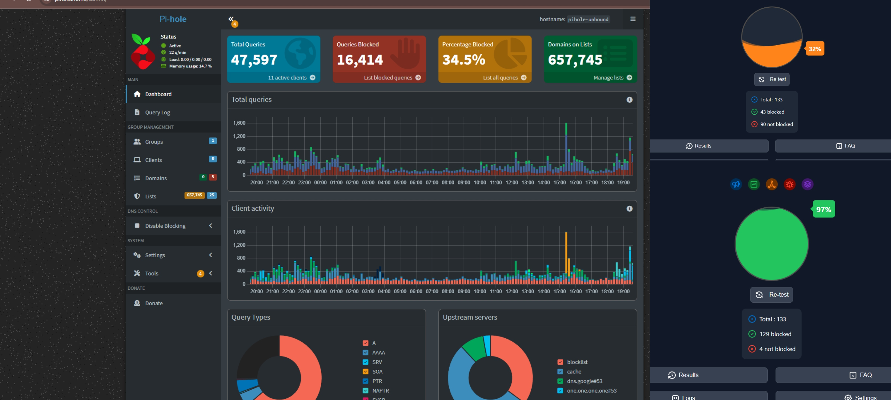
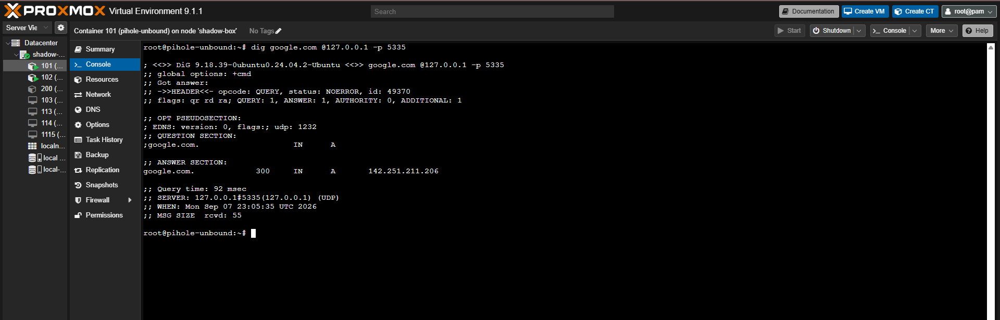
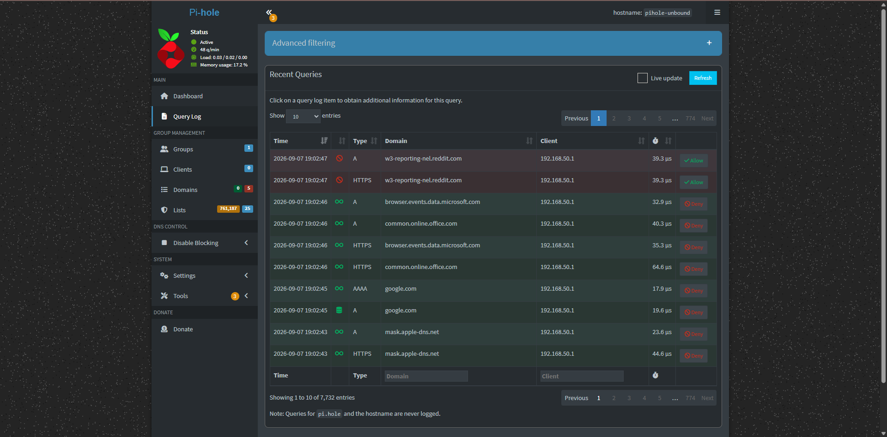
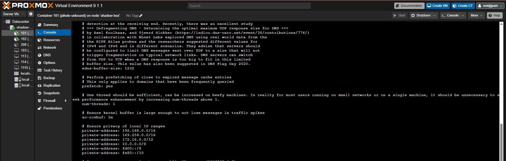
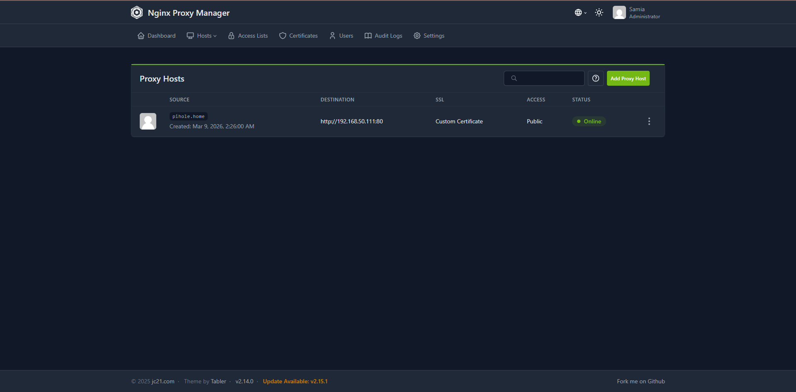

# Mitigating DNS Spoofing by Hardening a Home Network with Recursive DNS

A home lab project building a private, recursive DNS resolver to eliminate reliance on third-party DNS providers, block malicious domains and ads network-wide, and mitigate DNS spoofing at the network level.

## Environment

- **Hypervisor:** Proxmox VE
- **DNS filtering:** Pi-hole
- **Recursive resolver:** Unbound, hosted in a Linux Container (LXC)
- **Reverse proxy / TLS termination:** Nginx Proxy Manager

## Objective

Most home networks rely on a third-party DNS provider (ISP default, or a public resolver like 8.8.8.8) for every DNS lookup, and typically have little to no ad/malicious-domain filtering at the network level. This project builds a fully private, self-hosted DNS pipeline that:

1. Filters malicious domains and ads for every device on the network — including IoT devices that can't run their own filtering software
2. Removes dependence on third-party DNS providers entirely
3. Encrypts and secures the management plane for the infrastructure itself

## Architecture

```
Client devices → Pi-hole (DNS filtering) → Unbound (recursive resolver, LXC)
                                                  ↓
                                    Root & Authoritative nameservers
                                    (no third-party DNS provider in the path)

Admin traffic → Nginx Proxy Manager (reverse proxy, SSL/TLS) → management interfaces
```

## Process

### 1. DNS Filtering Layer — Pi-hole
Deployed Pi-hole as the network's DNS server, blocking ads and known-malicious domains for every connected device.

### 2. Recursive Resolution — Unbound
Rather than forwarding filtered queries to a third-party resolver, integrated **Unbound** (hosted in an LXC on Proxmox) as a full recursive resolver. This lets the lab query Root and Authoritative nameservers directly — the same way a public resolver would — instead of trusting a third party with every DNS lookup on the network. This is the core of the DNS-spoofing mitigation: the resolution path is fully under local control, with no intermediate provider to spoof or compromise.

### 3. Securing the Management Plane — Nginx Proxy Manager
Deployed Nginx Proxy Manager as a reverse proxy in front of admin interfaces, issuing SSL/TLS certificates to ensure all administrative traffic to the lab is encrypted rather than sent in plaintext.

## Results

Effectiveness was measured by tuning Pi-hole's blocklists and comparing before/after block rates:

| Metric | Before | After |
|---|---|---|
| Blocklist block rate | 32% | 97% |

Tuning the blocklist configuration alone produced a **~3x improvement** in blocked queries, meaningfully reducing the ad and malicious-domain traffic reaching every device on the network.



## Verification

**Confirming Unbound performs real recursive resolution** (not just forwarding) — queried Unbound directly on its listening port, bypassing Pi-hole:

```
$ dig google.com @127.0.0.1 -p 5335

;; Got answer:
;; ->>HEADER<<- opcode: QUERY, status: NOERROR, id: 49370
;; flags: qr rd ra; QUERY: 1, ANSWER: 1, AUTHORITY: 0, ADDITIONAL: 1

;; ANSWER SECTION:
google.com.             300     IN      A       142.251.211.206

;; Query time: 92 msec
;; SERVER: 127.0.0.1#5335(127.0.0.1) (UDP)
;; WHEN: Mon Sep 07 23:05:35 UTC 2026
```

`status: NOERROR` with a populated answer section confirms Unbound is resolving queries independently — not passing them through to a third-party DNS provider.



**Live query log** — Pi-hole's query log shows real-time filtering in action, including live-blocked telemetry/tracking domains (e.g. `w3-reporting-nel.reddit.com`) alongside normally-resolved traffic, confirming the filtering layer is active and discriminating correctly rather than blocking indiscriminately:



## Unbound Configuration

Unbound was configured as a recursive resolver bound to localhost, queried by Pi-hole on port 5335 — following the standard Pi-hole/Unbound integration pattern, with private address ranges declared to prevent reverse-lookup leakage to public root servers:

```
server:
    verbosity: 0
    interface: 127.0.0.1
    port: 5335
    do-ip4: yes
    do-udp: yes
    do-tcp: yes
    do-ip6: yes
    prefer-ip6: no
    harden-glue: yes
    harden-dnssec-stripped: yes
    use-caps-for-id: no
    edns-buffer-size: 1232
    prefetch: yes
    num-threads: 1
    so-rcvbuf: 1m
    private-address: 192.168.0.0/16
    private-address: 169.254.0.0/16
    private-address: 172.16.0.0/12
    private-address: 10.0.0.0/8
    private-address: fd00::/8
    private-address: fe80::/10
    private-address: 192.0.2.0/24
    private-address: 198.51.100.0/24
    private-address: 203.0.113.0/24
    private-address: 255.255.255.255/32
    private-address: 2001:db8::/32
```



## Infrastructure

Nginx Proxy Manager routes the local `pihole.home` domain to the Pi-hole backend over HTTPS, with a custom SSL certificate securing the admin interface:



## Screenshots

-  `screenshots/pihole-dashboard-blockrate.png` — Pi-hole dashboard and before/after block-rate test
-  `screenshots/pihole-query-log.png` — Live query log with real blocked/allowed traffic
-  `screenshots/unbound-dig-test.png` — dig test confirming Unbound's recursive resolution
-  `screenshots/unbound-config-file.png` — Unbound configuration on the LXC
-  `screenshots/npm-proxy-hosts.png` — Nginx Proxy Manager routing `pihole.home` to the Pi-hole backend

## Key Takeaways

- **DNS filtering and DNS spoofing mitigation are two different problems.** Pi-hole alone filters known-bad domains; adding a real recursive resolver (Unbound) removes the third-party trust dependency that makes spoofing and DNS-based attacks possible in the first place.
- **Network-level controls protect devices that can't protect themselves.** IoT devices typically can't run their own DNS filtering — putting the control at the network layer covers every device automatically.
- **Blocklist tuning has a measurable, significant impact** — a 32% → 97% jump from configuration changes alone, without adding new tools.

## Tools Used
Pi-hole · Unbound · Nginx Proxy Manager · Proxmox VE (LXC) · Linux
